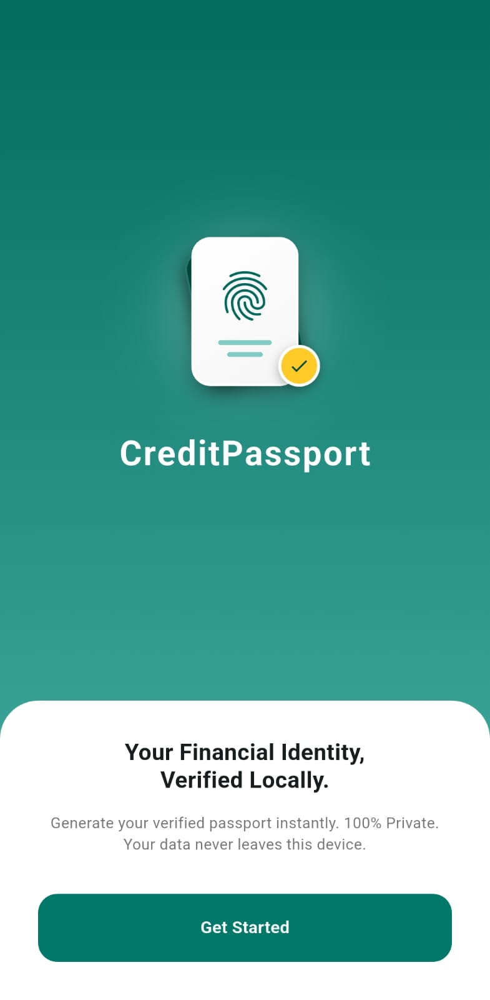
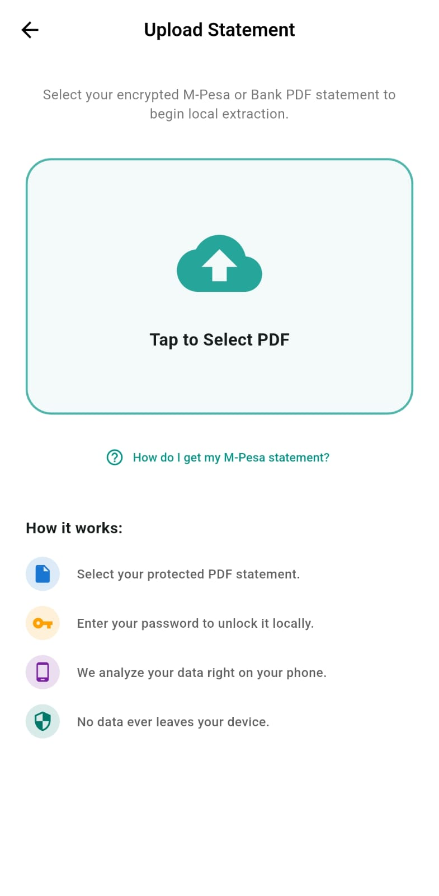
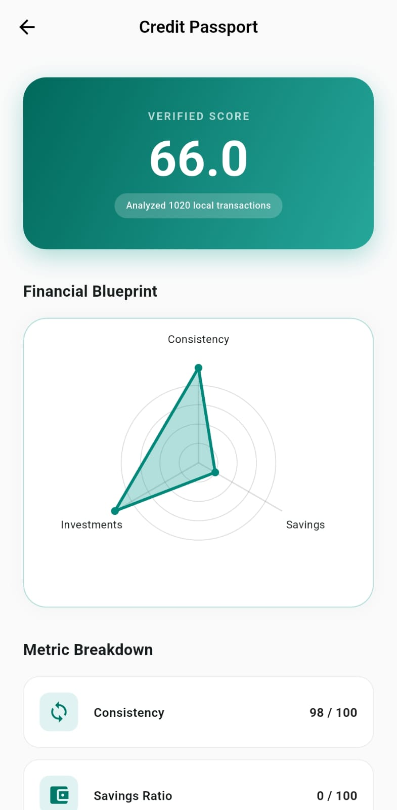
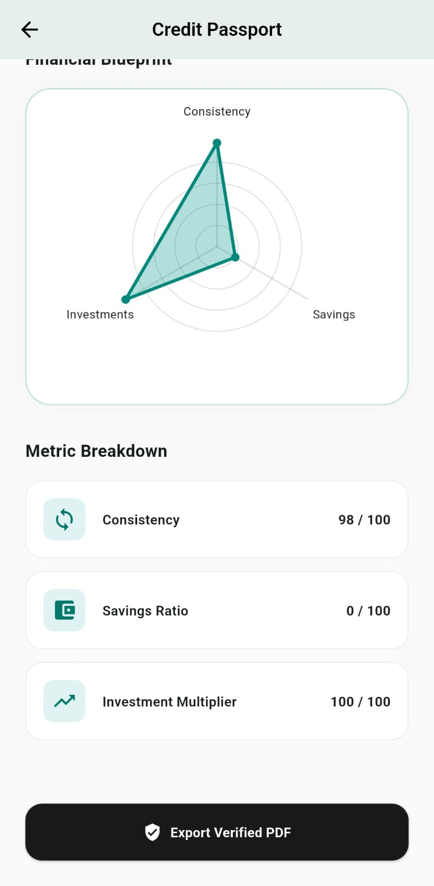

# 🛂 Credit Passport

Credit Passport is a modern Flutter application designed to analyze personal financial transactions and generate a verified "Trust Score" or "Credit Passport." By leveraging a powerful Trust Engine, it evaluates financial consistency, savings ratios, and investment multipliers to create a secure, cryptographically signed financial blueprint.

## ✨ Features

- **Transaction Analysis:** Securely process and extract raw transaction data.
- **Trust Engine Integration:** Evaluates financial data to generate a dynamic score and financial metrics.
- **Financial Blueprint:** Visualizes your financial health using interactive radar charts.
- **Verified Document Export:** Generates and exports a cryptographically verifiable PDF passport of your financial standing.
- **Dynamic Loading States:** Engaging UI with phased status updates during data crunching.

## 📸 App Snapshots

| Welcome Screen | Upload Screen | Dashboard | Verified PDF |
| :---: | :---: | :---: | :---: |
|  |  |  |  |

## 🛠️ Technology Stack

- **Framework:** [Flutter](https://flutter.dev/)
- **State Management:** [Riverpod](https://riverpod.dev/) (`flutter_riverpod`)
- **Charting:** [FL Chart](https://pub.dev/packages/fl_chart) (`fl_chart`)
- **PDF Generation & Printing:** `pdf`, `printing`, and `syncfusion_flutter_pdf`
- **File Handling:** `file_picker`
- **Network / API:** `http`

## 🚀 Getting Started

### Prerequisites

- [Flutter SDK](https://docs.flutter.dev/get-started/install) (Ensure your SDK is compatible with Dart `^3.11.5`)
- A running instance of the Trust Engine Python Backend (Required for `TrustEngineClient` to fetch scores).

### Installation

1. **Clone the repository:**
   ```bash
   git clone https://github.com/yourusername/credit_passport.git
   cd credit_passport
   ```

2. **Install dependencies:**
   ```bash
   flutter pub get
   ```

3. **Run the app:**
   ```bash
   flutter run
   ```

## 📂 Core Structure

- `lib/features/`: Contains the main UI features like `welcome`, `upload`, and `dashboard`.
- `lib/models/`: Dart models representing data structures (e.g., `Score`).
- `lib/services/`: Service classes for API communication (`TrustEngineClient`) and PDF generation (`PdfGenerator`).
- `lib/widgets/`: Reusable modular UI components.

## 🤝 Contributing

Contributions, issues, and feature requests are welcome! Feel free to check the issues page.

## 📄 License

This project is open-source and available under the [MIT License](LICENSE).
